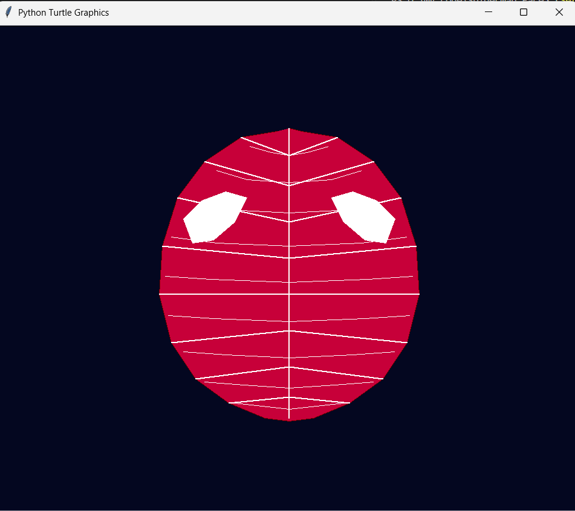

# 🕷️ Spider-Man Turtle Graphics Project

A fun and creative Python project using the built-in **Turtle** library to draw the iconic Spider-Man mask complete with detailed web patterns and eyes using precise geometric coordinates.

---

## Insights :
### GUI Interface


---
## Features
- **Precise Mask Shape**: Uses customized coordinate arrays to draw the distinctive Spider-Man mask filled with vibrant red/crimson tones.
- **Detailed Eyes**: Accurately renders both the left and right eyes in solid white to match the classic character design.
- **Spider-Web Details**: Draws intersecting radial web lines (`web_lines`) and concentric web rings (`web_rings`) for a realistic mask texture.
- **Dark Theme Background**: Sets a sleek dark background (`#040720`) to make the mask and white web pop out clearly.

---

## Prerequisites
No complex external dependencies are required! All you need is:
- **Python 3.x** installed on your system.
- The **Turtle** library (which comes pre-installed by default with standard Python).

---

## How to Run
1. Ensure Python is installed on your machine.
2. Create a new Python file named `spider.py` and paste the code into it.
3. Open your terminal or command prompt in the folder containing the file.
4. Run the script using the following command:
   ```bash
   python spider.py
    ```
---

## 📂 Project Architecture & Workflow
### The diagram below illustrates how the script executes and renders the graphics step-by-step:
```
[ Start: Initialize Turtle Screen & Settings ]
                     │
                     ▼
          [ Set Background Color ]
          ( Dark Blue: #040720 )
                     │
                     ▼
       ┌───────────────────────────┐
       │   Execution & Drawing     │
       └─────────────┬─────────────┘
                     │
         ┌───────────┼───────────┬───────────┐
         ▼           ▼           ▼           ▼
     [Head]       [Eyes]    [Web Lines] [Web Rings]
       │           │           │           │
       ▼           ▼           ▼           ▼
   Draw Mask    Draw Left   Draw Radial  Draw Curved
   Polygon &    & Right     Spider      Web Rings
   Fill Red     White Eyes    Lines     (Concentric)
         │           │           │           │
         └───────────┼───────────┴───────────┘
                     │
                     ▼
         [ Update Screen & Display ]
                     │
                     ▼
            [ turtle.mainloop() ]
              ( End / Keep Open )
```
